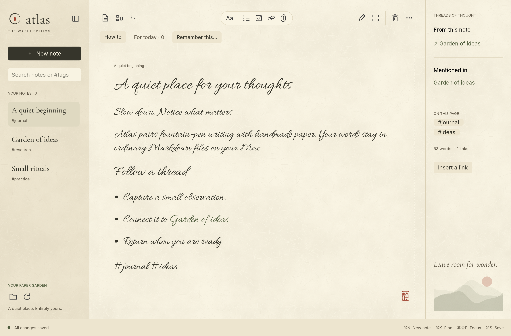
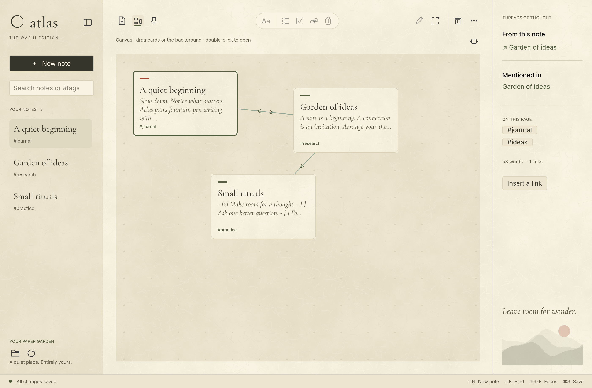

# Atlas — the Washi Edition

[GitHub · flyndagr/atlas-washi](https://github.com/flyndagr/atlas-washi)

A quiet, native Rust notebook for macOS. Fountain-pen typography, handmade paper, and a canvas for connected ideas. Your notes remain ordinary Markdown files on your Mac.



## A little space for big ideas

- **Write and read:** Markdown source editing, clean rendered reading, autosave, headings, lists, checklists, links, and code.
- **Connect:** `[[Wiki links]]`, backlinks, local attachments, and a canvas of draggable note cards.
- **Make it yours:** four paper/ink palettes, adjustable fibers, fountain script or typeset text.
- **Keep control:** import files/folders, export Markdown or a notebook with assets, rename, duplicate, recoverable Trash.
- **Stay local:** no accounts, analytics, server, API keys, or app-managed cloud storage.



[Watch the 18-second demo](docs/media/atlas-demo.mp4).

## Build and run

Tested on Apple silicon macOS with Rust 1.98. The current release is an early prototype. Install a current stable Rust toolchain and Apple's command-line developer tools, then:

```sh
cargo run --release --locked
# Use a separate notebook:
cargo run --release --locked -- --vault /absolute/path/to/notebook
# Build a local macOS app:
bash packaging/macos.sh
open dist/Atlas.app
```

The default notebook is `~/Documents/Codex/Atlas Vault`. Five sample notes are created only for a new empty notebook. The app bundle is locally ad-hoc signed, not Apple-notarized. Other platforms are not tested; file-opening integration currently targets macOS.

## Controls

Choose **How to** above the page to open the in-app guide. It explains notes and canvas with a diagram, writing, remembering, and file recovery. Reopen it anytime; Escape or Got it closes it.

Hover any icon for its label. The document icon opens Files (new/import/export/Trash). The canvas icon switches between notebook and canvas; the pin adds the selected note and brings it into view.

- **Sidebar:** changes only the left notes panel.
- **Focus (⌘⇧F):** hides both panels and restores the previous layout.
- **Pencil / checkmark:** edit Markdown / return to clean reading.
- **Canvas zoom:** use − / +, click the percentage to reset to 100%, or pinch over the canvas. Zoom ranges from 25% to 300% and is saved with the layout.
- **Canvas:** drag a card to arrange it, drag empty space to pan, double-click a card to open it, right-click to unpin without deleting the note. The target icon brings the selected pinned card into view.
- **Note context menu:** right-click a sidebar note to open, rename, duplicate, export, or move it to Trash.
- **Lists:** select lines while editing, then choose bullets, numbers, or a checklist. Enter continues a list; Enter on an empty item ends it.
- **Folder / refresh:** reveal the notebook in Finder / read changes made outside Atlas. Atlas also checks Markdown files every two seconds, retaining the selected file when the list changes. Automatic refresh waits while a draft is unsaved or a conflict dialog is open. External rename/deletion clears the selection rather than switching to a different note.
- **⌘N / ⌘K / ⌘S / ⌘O / ⇧⌘S:** new note / search / save / import Markdown / export current draft.

## Things to remember

While editing, select a passage and choose **Remember this…**. In reading mode, enter the context yourself. Add an intention, an optional person, and an optional review date (`YYYY-MM-DD`). Atlas creates a separate Markdown note with a source link and a captured quote; your original prose stays intact.

**For today** shows open items whose review date has arrived. **Anytime** holds undated items; **All** includes future, completed and dismissed items. Use Mark done, Reopen, or Change date; More offers Set aside and Open remembered note. Today and Anytime are quick date choices. Saving an intention opens the appropriate review tab. Context is a snapshot: it does not automatically track later edits. A missing source leaves the captured context available.

This first version is an **in-app review**, not a background alarm: open Atlas to check it. It uses your Mac's local date, with no AI service, account, or notification permission. Remembered notes export with the rest of your Markdown; you can edit or trash them like ordinary notes. Keep the generated metadata header intact for the review list to recognize them. Start directly in review with `atlas --review`.

[Research, rollout plan and pilot criteria](docs/remember-plan.md).

## Files and recovery

### Connections belong to your notes

Canvas arrows come directly from `[[wiki links]]` in your Markdown files. For example, adding `[[Garden of ideas]]` to `A quiet beginning.md` connects those notes; pin both notes to see the arrow. Use **Insert a link** in the right panel or type the link while editing, then save.

Atlas does not store a separate set of connections in its canvas file. `.atlas/canvas.json` holds only card positions, zoom, and the pan offset. Removing a card from the canvas leaves its note and links intact. Exporting the notebook preserves the Markdown links and attachments, while leaving out the Atlas-specific layout. You can read the links in any text editor or use them in a wiki-link-aware app. Copy the whole notebook folder if you also want to preserve the canvas arrangement.

Markdown notes may be nested. Attachments live in `attachments/`; `.atlas/` stores appearance, canvas positions, Trash, and rename backups. Back up the **whole notebook folder** to retain all of them. Notebook export copies visible notes/assets and intentionally excludes hidden Atlas state.

Writes use atomic replacement and check for external changes. On a note conflict, the draft stays in the app and can be saved as a new note. Canvas conflicts preserve the existing file. Use one app instance per notebook; this is not a multi-process synchronization system. Closing is blocked if a save fails.

Folder import preserves relative asset paths and copies into a unique `imports/` folder. Single-file import copies Markdown text only. Imports reject symbolic links, enforce limits (5 MB per note; 500 MB/10,000 files per folder), and never overwrite existing notes. Exports require new destinations. Rename updates resolved wiki and inline Markdown links, not reference-style link definitions.

## Current limits

No sync, plugins, inline rich-text editing, full Markdown tables/math, built-in image/PDF viewer, native filesystem event watching (automatic refresh uses polling). Canvas cards are fixed-size summaries; long titles/excerpts are shortened. Checklist rendering is visual; edit its Markdown to change completion. Keep backups of valuable work while evaluating the prototype.

## Development

```sh
cargo fmt --check
cargo clippy --all-targets --locked -- -D warnings
cargo test --locked
```

See [CONTRIBUTING.md](CONTRIBUTING.md). CI runs on macOS. A passed local test run is not a substitute for the GitHub Actions result.

## License and credits

Application code and original artwork: [MIT](LICENSE). Bundled fonts: SIL OFL, with license texts in `assets/`. See [THIRD_PARTY_NOTICES.md](THIRD_PARTY_NOTICES.md).

Inspired by the local-first spirit of [Lightcraft](https://github.com/storytold/lightcraft) and familiar note-taking interactions. Atlas is an independent project, not an affiliated or official version of those products.
